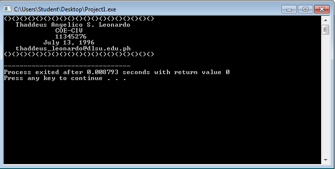

```
#include <stdio.h>
#include <stdlib.h>

int main(){
	{ puts("()()()()()()()()()()()()()()()()()()()");
  puts("   Thaddeus Angelico S. Leonardo");
  puts("             COE-CIV");
  puts("             11345276");
  puts("          July 13, 1996");
  puts("   thaddeus_leonardo@dlsu.edu.ph");
  puts("()()()()()()()()()()()()()()()()()()()");
	system("PAUSE");
	return 0;
}
```



